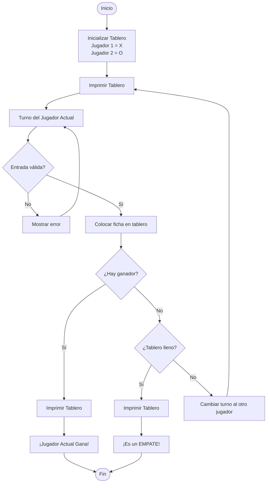
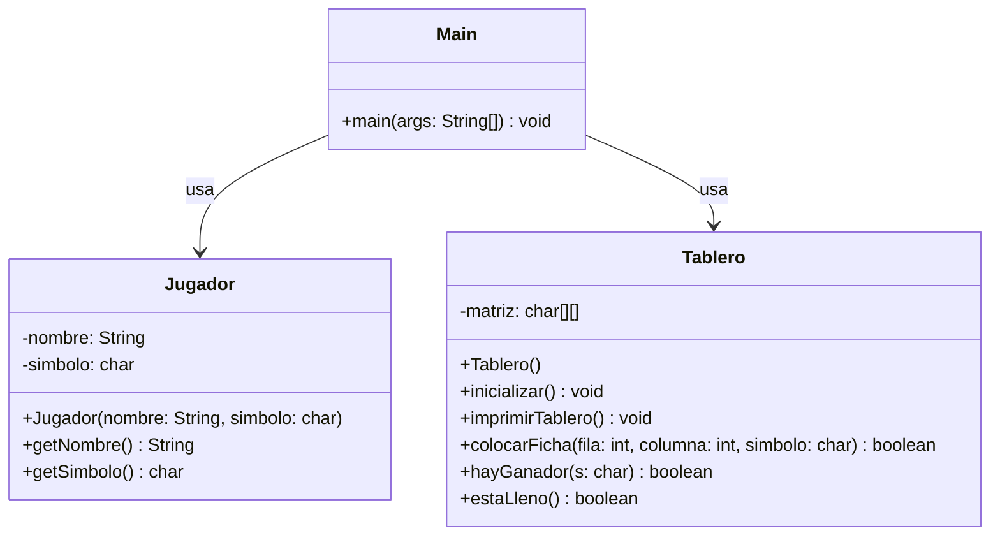

# Diagramas del Juego 3 en Raya

## Diagrama de Flujo del Juego

```mermaid
flowchart TD
    A([Inicio]) --> B[Inicializar Tablero<br/>Jugador 1 = X<br/>Jugador 2 = O]
    B --> C[Imprimir Tablero]
    C --> D["Turno del Jugador Actual"]
    D --> E{Entrada válida?}
    E -->|No| F[Mostrar error]
    F --> D
    E -->|Sí| G[Colocar ficha en tablero]
    G --> H{¿Hay ganador?}
    H -->|Sí| I[Imprimir Tablero]
    I --> J["¡Jugador Actual Gana!"]
    J --> K([Fin])
    H -->|No| L{¿Tablero lleno?}
    L -->|Sí| M[Imprimir Tablero]
    M --> N["¡Es un EMPATE!"]
    N --> K
    L -->|No| O[Cambiar turno al otro jugador]
    O --> C
```

---

## Diagrama de Clases (UML)

```mermaid
classDiagram
    class Main {
        +main(args: String[]) void
    }
    class Jugador {
        -nombre: String
        -simbolo: char
        +Jugador(nombre: String, simbolo: char)
        +getNombre() String
        +getSimbolo() char
    }
    class Tablero {
        -matriz: char[][]
        +Tablero()
        +inicializar() void
        +imprimirTablero() void
        +colocarFicha(fila: int, columna: int, simbolo: char) boolean
        +hayGanador(s: char) boolean
        +estaLleno() boolean
    }
    Main --> Jugador : usa
    Main --> Tablero : usa
```
